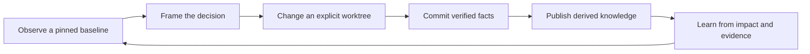

# Git Commit + Knowledge: Development Philosophy and Iteration Loop

[English](26-git-commit-knowledge-development-loop.md) | [中文](../../zh/03-architecture-specs/26-git-commit-knowledge-development-loop.md)

> Document version: 1.0
> Prepared: 2026-08-13
> Scope: mental model, fact boundaries, collaboration, recovery, and acceptance criteria

## 1. Position and Boundary with Chapter 24

This standalone chapter defines the philosophy and mental model for a **Git
Commit + Knowledge** development loop. A Git commit is the immutable anchor for
repository facts. Derived knowledge supplies provenance-backed evidence, and
human-agent collaboration organizes evidence, intent, and judgment into the
decision context used to understand, change, verify, and learn from those facts.

[Chapter 24](24-code-map-backed-knowledge-development-loop.md) remains the
implementation contract: it specifies knowledge-map bootstrap, code-map
publication, CLI coordination, task leases, freshness, and evidence gates.
This chapter explains why that contract is shaped around commits and how humans
and agents should reason about the loop. It introduces no new CLI command,
background service, or persistence authority.

## 2. Mental Model

The loop has three distinct kinds of state:

| State | Meaning | Authority |
| --- | --- | --- |
| Git commit | Immutable tracked repository content identified by a commit and tree | Git |
| Derived knowledge | Code graph, software projection, impact, and retrieval evidence published for an exact source scope | Versioned indexes and projections |
| Decision context | Requirement, evidence, constraints, alternatives, uncertainty, verification, and handoff notes | Human-reviewed workflow artifacts backed by provenance |

Git does not contain every reason behind a decision. Knowledge does not replace
Git's fact boundary. The loop works only when decision context points back to a
specific commit or an explicitly named provisional worktree overlay, and every
derived view reports the scope and freshness it actually serves.

## 3. Commit Fact Boundary

A commit fact is a statement that can be checked against tracked content at an
exact commit and tree. It may describe source, documentation, manifests,
configuration, tests, or deployment definitions present in that snapshot.

The commit boundary does **not** include:

- uncommitted worktree changes or untracked ignored/generated output;
- runtime databases, mutable service state, or unpublished index checkpoints;
- an LLM summary, review opinion, or inferred design narrative;
- external dependency source outside the authorized indexed scope;
- a claim that tests passed, performance improved, or behavior is correct
  unless the corresponding evidence is recorded separately.

A worktree overlay is useful provisional evidence, but it must remain labeled
`worktree`. It cannot be presented as a commit fact. A derived graph or software
model is authoritative only for its resolved commit, tree hash, source scope,
and published graph/index version. A commit is therefore a comparison and
recovery anchor, not proof of correctness by itself.

## 4. Loop Stages

1. **Observe** — select a clean commit baseline; read relevant knowledge routes,
   repository status, software views, code context, freshness, and degradation.
2. **Frame** — state the requirement, constraints, alternatives, uncertainties,
   and acceptance evidence before editing.
3. **Change** — make bounded worktree changes. When provisional retrieval is
   needed, index and query the explicit worktree overlay rather than implying
   that `HEAD` already contains the edits.
4. **Commit** — run the proportionate gates, review the diff, and create one
   immutable fact boundary. The commit records what changed, while verification
   evidence records what was demonstrated.
5. **Publish** — update or index that exact commit through the durable
   single-writer workflow. Wait for the exact target and its derived software
   model to become current before calling the publication complete.
6. **Learn** — compare impact, outcomes, and diagnostics with the framed
   decision. Update stable knowledge routes when authoritative sources moved;
   do not persist an unverified narrative as a repository fact.

The cycle can revisit an earlier stage. A failed gate returns to **Frame** or
**Change**; a stale publication remains in **Publish**; contradictory evidence
returns to **Observe**. Recovery must preserve the last valid commit and durable
checkpoint instead of manufacturing a clean state.

## 5. Knowledge Decision Context

Decision context should be small enough to review and complete enough to
reproduce the choice. At minimum it contains:

| Context field | Required content |
| --- | --- |
| Identity | Repository, resolved base/head or explicit `worktree`, tree/source scope, and freshness |
| Intent | Requirement, user outcome, authorization boundary, and non-goals |
| Evidence | Knowledge routes, facts, symbols, relationships, source locations, and provenance ids |
| Constraints | Architecture invariants, resource budgets, compatibility, security, and release obligations |
| Judgment | Alternatives considered, chosen trade-off, uncertainty, and unresolved targets |
| Change | Affected files/symbols, expected impact, migration or rollback notes |
| Verification | Requirement-to-test/gate mapping and actual result for each relevant layer |
| Handoff | Current commit/ref, publication state, degradation, follow-up ownership, and recovery point |

The context may include a concise explanation, but every factual claim must be
traceable to repository, graph, runtime, test, or external source evidence.
Missing evidence remains an explicit gap; it is not filled with a plausible
agent-generated statement.

## 6. Failure and Recovery

| Failure | Safe recovery | Invalid shortcut |
| --- | --- | --- |
| Dirty worktree described as `HEAD` | Relabel and query `worktree`, or commit and use the new immutable ref | Treat uncommitted text as a commit fact |
| Index task queued, retrying, or leased | Resume through the managed service or bounded single-shot worker described in Chapter 24 | Start competing writers or an unmanaged polling loop |
| Exact commit is stale or unpublished | Keep the last fresh scope visible, report lag, and wait or recover the durable task | Return success before finalization |
| Projection is degraded | Use unaffected evidence with disclosure and verify affected source directly | Hide degradation or omit indexing stages |
| Knowledge map is invalid or conflicting | Stop mutation, preserve the file, and report validation diagnostics | Overwrite routes or edit history silently |
| Verification fails | Keep or revert to the last accepted commit, refine the decision, and rerun the failed layer | Reclassify the failing gate as optional |
| Commit is reverted or rebased | Publish the new exact history and retain the old commit as auditable prior state | Rewrite derived scope identity in place |

Recovery is forward and evidence-preserving. Git supplies the stable rollback
point; durable task state supplies resumability; knowledge context explains why
the recovery path was chosen.

## 7. Human–Agent Collaboration and Handoff

Humans own intent, authorization, risk acceptance, and product judgment. Agents
collect bounded evidence, make scoped changes, run authorized gates, explain
uncertainty, and maintain provenance. Neither role may silently broaden the
authorized source scope or turn a derived inference into an accepted fact.

A useful handoff answers five questions:

1. Which exact commit or worktree was used?
2. What decision was made, and which evidence supports it?
3. What changed, and what remains explicitly out of scope?
4. Which gates passed, failed, timed out, or were not run?
5. Is derived knowledge fresh, stale, degraded, queued, or unpublished, and
   where can recovery resume?

This handoff lets another human or agent continue without reconstructing intent
from a diff or trusting hidden conversational state.

## 8. Acceptance Criteria

| ID | Criterion | Evidence required |
| --- | --- | --- |
| GCK-01 | Every factual development baseline names an immutable commit or explicit worktree overlay | Handoff and retrieval metadata expose the selected ref and resolved identity |
| GCK-02 | Commit facts, derived knowledge, and decision context remain distinct | Review finds no worktree/LLM/runtime claim presented as committed source fact |
| GCK-03 | The six loop stages have explicit entry and exit evidence | Workflow record covers observe, frame, change, commit, publish, and learn |
| GCK-04 | Publication serves the exact committed target before freshness is claimed | Repository status and projection metadata agree on scope and target |
| GCK-05 | Failure keeps a valid recovery point and observable state | Reproduction shows commit/checkpoint preservation and bounded recovery |
| GCK-06 | Human and agent responsibilities are explicit at authorization and acceptance boundaries | Review and handoff identify owner, scope, judgment, and unresolved risk |
| GCK-07 | Verification matches the requirement's breadth | Requirement-to-evidence matrix distinguishes unit, integration, browser, coverage, package, and performance gates |
| GCK-08 | Chapter 26 remains conceptual and Chapter 24 remains executable | Documentation review finds no duplicate CLI contract or invented capability here |

## 9. Relationship to the Implementation Contract

Use this chapter to frame decisions, fact boundaries, recovery, and
collaboration. Use [Chapter 24: Code-Map-Backed Knowledge Development
Loop](24-code-map-backed-knowledge-development-loop.md) to execute repository
bootstrap, indexing, map validation, context acquisition, incremental refresh,
and acceptance gates. A conforming workflow needs both: Chapter 26 supplies the
mental model; Chapter 24 supplies the operational contract.

---

Navigation: [Architecture Specifications](README.md) | Previous: [25. Code Index Retention](25-code-index-retention.md) | Next: [Documentation bookshelf](../README.md)
