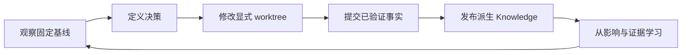

# Git Commit + Knowledge：开发迭代理念与 Loop

[中文](26-git-commit-knowledge-development-loop.md) | [English](../../en/03-architecture-specs/26-git-commit-knowledge-development-loop.md)

> 文档版本: 1.0
> 编制日期: 2026-08-13
> 适用范围: 心智模型、事实边界、协作、恢复与验收准则

## 1. 定位及与第 24 章的边界

本章独立阐述 **Git Commit + Knowledge** 开发迭代 Loop 的理念与心智模型：Git commit 是仓库事实的不可变锚点；派生 Knowledge 提供带 provenance 的证据，再由人机协作把证据、意图和判断组织成决策上下文，用于理解、修改、验证并从这些事实中学习。

[第 24 章](24-code-map-backed-knowledge-development-loop.md)仍是落地契约，规定 knowledge map bootstrap、code map publication、CLI 协调、task lease、freshness 和证据门禁。本章解释为什么这些契约围绕 commit 组织，以及人和 agent 应如何推理闭环；它不新增 CLI 命令、后台服务或持久化权威源。

## 2. 心智模型

闭环中有三类必须分开的状态：

| 状态 | 含义 | 权威来源 |
| --- | --- | --- |
| Git commit | 由 commit 和 tree 标识的不可变、已跟踪仓库内容 | Git |
| 派生 Knowledge | 针对精确 source scope 发布的业务术语/映射、代码图、软件投影、impact 和检索证据 | 版本化索引与投影 |
| 决策上下文 | requirement、证据、约束、备选方案、不确定性、验证和交接记录 | 带 provenance、经人审查的工作流产物 |

Git 不保存每项决策背后的全部理由；Knowledge 也不能取代 Git 的事实边界。只有当决策上下文指向精确 commit，或明确标记为临时 `worktree` overlay，且每个派生视图报告其真实 scope 和 freshness 时，闭环才成立。

## 3. Commit 事实边界

Commit 事实是能在精确 commit 和 tree 的已跟踪内容中核对的陈述，可以涉及该快照内的源码、文档、manifest、配置、测试或部署定义。

以下内容不属于 commit 事实：

- 未提交的 worktree 变化，以及未跟踪的 ignored 或 generated 输出；
- 运行时数据库、可变 service 状态和未发布的 index checkpoint；
- LLM 摘要、review 意见或推断出的设计叙述；
- 授权 indexed scope 之外的外部依赖源码；
- “测试已通过”“性能已改善”或“行为正确”等结论，除非另有对应验证证据。

Worktree overlay 可以作为临时证据，但必须保持 `worktree` 标记，不能表述为 commit 事实。派生图或软件模型只对其 resolved commit、tree hash、source scope 与已发布 graph/index version 有效。因此 commit 是比较和恢复锚点，而不是正确性证明本身。

## 4. 闭环阶段

1. **观察（Observe）**：选择 clean commit 基线；读取 `business-knowledge` route、同 ref 的 `repo business`、software/architecture/business-domain view、code context、freshness 与 degradation。
2. **定义（Frame）**：编辑前写清 requirement、约束、备选方案、不确定性和验收证据。
3. **修改（Change）**：进行有边界的 worktree 变更。若需要检索未提交内容，显式索引并查询 worktree overlay，不暗示 `HEAD` 已包含这些变更。
4. **提交（Commit）**：运行与风险相称的门禁、审查 diff，并创建一个不可变事实边界。Commit 记录“改了什么”，验证证据记录“证明了什么”。
5. **发布（Publish）**：通过 durable single-writer 工作流更新或索引精确 commit。业务与代码/软件 projection 共用 task lease、attempt 和 publication fence；任一未完成时都不得声称精确 target 已发布。
6. **学习（Learn）**：把 impact、结果和 diagnostics 与初始决策对照。权威源移动时更新稳定 knowledge route；不得把未验证叙述持久化为仓库事实。

闭环可以回退到较早阶段：门禁失败回到“定义”或“修改”，stale publication 停在“发布”，证据冲突回到“观察”。恢复必须保留最后一个有效 commit 和 durable checkpoint，不能制造虚假的 clean 状态。

## 5. Knowledge 决策上下文

决策上下文应足够小，以便审查；也应足够完整，以便复现选择。至少包含：

| 上下文字段 | 必需内容 |
| --- | --- |
| Identity | repository、resolved base/head 或显式 `worktree`、tree/source scope 与 freshness |
| Intent | requirement、用户结果、授权边界与 non-goals |
| Evidence | knowledge route、事实、symbol、relationship、源码位置与 provenance id |
| Constraints | 架构不变量、资源预算、兼容性、安全与发布义务 |
| Judgment | 考虑过的方案、选定 trade-off、不确定性与 unresolved target |
| Change | 受影响文件/symbol、预期 impact、migration 或 rollback 说明 |
| Verification | requirement 到 test/gate 的映射，以及各相关验证层的实际结果 |
| Handoff | 当前 commit/ref、publication 状态、degradation、后续责任人与恢复点 |

上下文可以包含简短说明，但每项事实声明都必须追溯到仓库、图、运行时、测试或外部来源证据。缺失证据必须保留为显式 gap，不能用貌似合理的 agent 生成陈述填补。

## 6. 失败与恢复

| 失败 | 安全恢复 | 无效捷径 |
| --- | --- | --- |
| Dirty worktree 被描述为 `HEAD` | 重新标记并查询 `worktree`，或提交后使用新的不可变 ref | 把未提交文本当作 commit 事实 |
| Index task queued、retrying 或持有 lease | 按第 24 章通过 managed service 或有界 single-shot worker 恢复 | 启动竞争 writer 或 unmanaged polling loop |
| 精确 commit stale 或未发布 | 保持最后一个 fresh scope 可读，报告 lag，并等待或恢复 durable task | finalize 前返回成功 |
| Projection degraded | 披露缺口、使用未受影响证据，并直接核对受影响源码；授权 scope 外技术目标只保留 unresolved hint | 隐藏 degradation、把 unresolved external 映射标成仓库损坏或省略索引阶段 |
| Knowledge map invalid 或 conflicting | 停止 mutation、保留文件并报告 validation diagnostics | 覆盖 route 或静默改写 history |
| Verification 失败 | 保留或回到最后 accepted commit，修正决策并重跑失败层 | 把失败门禁降级为 optional |
| Commit 被 revert 或 rebase | 发布新的精确历史，将旧 commit 保留为可审计前态 | 就地改写派生 scope identity |

恢复必须前向推进并保存证据。Git 提供稳定 rollback point，durable task 状态提供 resumability，Knowledge 上下文解释为什么选择该恢复路径。

## 7. 团队与 Agent 协作

人负责 intent、authorization、风险接受与产品判断；agent 负责收集有界证据、实施 scope 内变更、执行已授权门禁、解释不确定性并维护 provenance。任何一方都不能静默扩大 authorized source scope，也不能把派生推断变成已接受事实。

有效交接应回答五个问题：

1. 使用了哪个精确 commit 或 worktree？
2. 做出了什么决策，哪些证据支持它？
3. 改了什么，哪些内容仍明确 out of scope？
4. 哪些门禁通过、失败、超时或未运行？
5. 派生 Knowledge 是 fresh、stale、degraded、queued 还是 unpublished，恢复从哪里继续？

这样的交接允许下一位人或 agent 继续工作，而无需从 diff 猜测意图或信任隐藏的对话状态。

## 8. 验收准则

| ID | 准则 | 所需证据 |
| --- | --- | --- |
| GCK-01 | 每个事实基线都指明 immutable commit 或显式 worktree overlay | 交接与检索 metadata 暴露所选 ref 和 resolved identity |
| GCK-02 | Commit 事实、派生 Knowledge 与决策上下文保持分离 | Review 未发现 worktree、LLM 或 runtime 声明冒充已提交源码事实 |
| GCK-03 | 六个闭环阶段都有明确进入与退出证据 | 工作流记录覆盖 observe、frame、change、commit、publish 与 learn |
| GCK-04 | Freshness 声明前 publication 已服务精确 committed target | Repository status 与 projection metadata 的 scope 和 target 一致 |
| GCK-05 | 失败时保留有效恢复点和可观察状态 | 复现证明 commit/checkpoint 保留且恢复有界 |
| GCK-06 | 人与 agent 在 authorization 和 acceptance 边界上的责任明确 | Review 与 handoff 标出 owner、scope、judgment 和 unresolved risk |
| GCK-07 | 验证范围与 requirement 范围匹配 | Requirement-to-evidence 矩阵区分 UT、integration、browser、coverage、package 和 performance |
| GCK-08 | 第 26 章保持理念层，第 24 章保持落地层 | 文档审查确认本章未重复 CLI 契约或虚构能力 |

## 9. 与落地契约的关系

用本章定义 decision、事实边界、恢复和协作；用[第 24 章：代码地图驱动的 Knowledge 开发闭环](24-code-map-backed-knowledge-development-loop.md)执行 repository bootstrap、indexing、map validation、context acquisition、incremental refresh 与验收门禁。合规工作流需要二者：第 26 章提供心智模型，第 24 章提供可执行契约。

---

导航：上一章：[25. 代码索引保留策略](25-code-index-retention.md) | 下一章：[27. 业务知识与技术图谱映射](27-business-knowledge-technical-mapping.md) | 返回：[架构规格](README.md)
